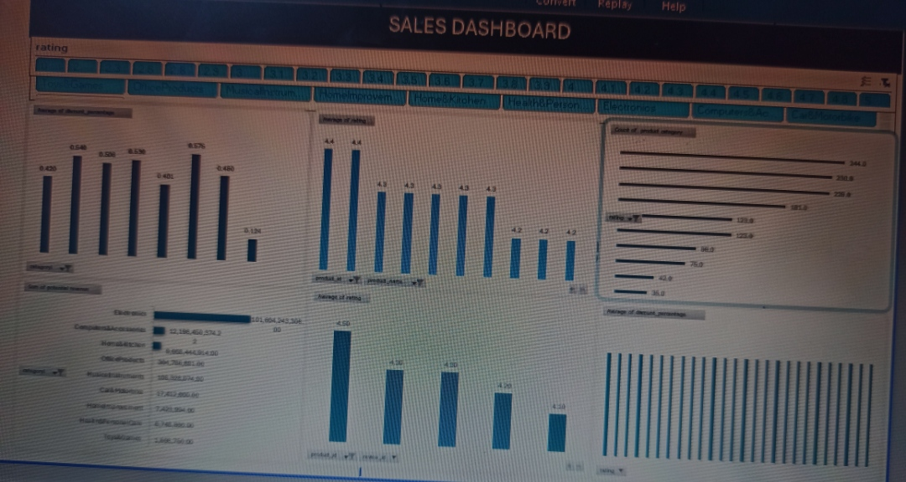

# DSA-AMAZON-REVIEW-ANALYSIS
This respository contains my Data analysis capstone project for the amazon product review data set
the analysis was done  using excel and it includes data cleaning, pivot table  analysis, and a dashboard

## Files in This Repository
- *Amazon case study project dashboard*  Contains: - Cleaned Data
- Pivot Table Q&A (14 questions answered)
- Dashboard
- **
-  A preview image of the dashboard.

## Dashboard Overview
The dashboard highlights:
- Average discount % by category
- Products that have the highest average ratings			
- Distribution of product ratings	
- Total potential revenue
- The top 5 products in terms of rating and number of reviews combined
-  How  rating relate to the level of discount

##  Question & Answer Analysis
The Q&A Analysis sheet in the Excel file answers:
1. Average discount percentage by category
2. Number of products per category
3. Total number of reviews per category
4. Products with highest average ratings
5. Average price vs discounted price by category
6. Products with highest number of reviews
7. Products with 50% discount or more
8. Rating distribution across products
9. Potential revenue by category
10. Products per price range bucket
11. Relationship between rating and discount
12. Products with fewer than 1,000 reviews
13. Categories with highest discounts
14. Top 5 products (rating + reviews)
    

## Tools Used
- Excel (Pivot Tables, Charts, Dashboard)
- Data Cleaning

##  How to Use
1. Download Amazon case study project dashboard.xlsx.
2. Open in Excel.
3. Navigate between the *AMAZON DATA, **PIVOT TABLES Q&A Analysis, and **DASHBOARD * sheet.
4. Use slicers to interact with the dashboard.

